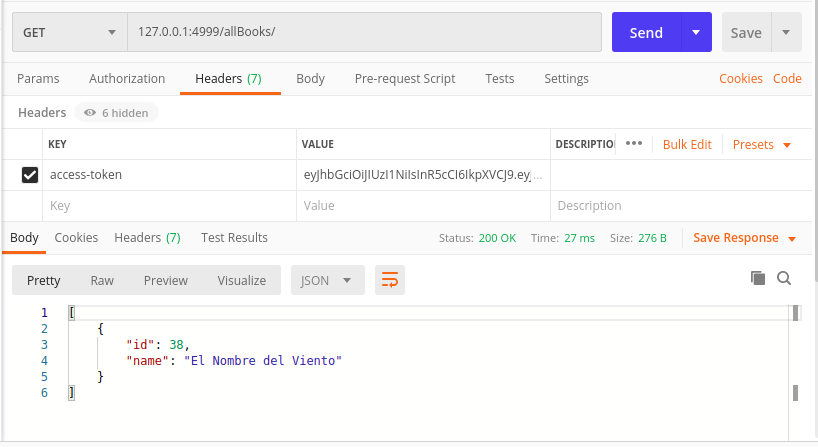

# prueba-backend

## Montar el servidor 

Antes de correr se debe obtener/configurar los archivos app.env y db.env que contienen variables de ambiente :)  Para configurar, basta rellenar los archivos [app.env.template](app.env.template) / [db.env.template](db.env.template) y remover template del nombre. 


Para correr, con imagenes de dockerhub:

```
git clone http://github.com/joseastorga/prueba-backend.git

cd prueba-backend

docker-compose pull

docker-compose up 

```

Para correr, con build local de la imagen:


```
git clone http://github.com/joseastorga/prueba-backend.git

cd prueba-backend

docker pull postgres  # Usamos una imagen generica de postgres

docker build -t astorgato/prueba-backend . # se puede cambiar el nombre a la imagen pero debe ser consistente y cambiarlo también en el docker-compose.yml

docker-compose up 

```


## Utilizar


### login 

Dirigirse a http://localhost:4999/auth/google/ para realizar login a través de su cuenta de google. 

Al final del proceso de login se obtendrá un token JWT (con expiración en 30 minutos) que debe utilizar para realizar sus consultas. 

Este token lo debe añadir al header de sus posteriores consultas, bajo la llave access-token. 




